# Dompet Kampus Global / Dana zaQi (DaQi) — Aplikasi E-Money Mobile

> Ujian Akhir Semester · Aplikasi Mobile Lanjutan

---

## 👨‍🎓 Identitas Mahasiswa

|           |                             |
| --------- | --------------------------- |
| **Nama**  | Zaqi Maulana                |
| **NIM**   | *(1123150048)*              |
| **Kelas** | *(TI SE 23 SH)*             |


---

## 📱 Deskripsi Aplikasi
**Dompet Kampus Global / Dana zaQi (DaQi)** adalah aplikasi e-money berbasis mobile yang dirancang khusus untuk memfasilitasi transaksi keuangan di lingkungan kampus. Aplikasi ini memungkinkan pengguna melakukan transaksi digital secara cepat, aman, dan efisien — mulai dari top up saldo, transfer, hingga pembayaran ke merchant menggunakan sistem *deep link* lintas aplikasi.

Aplikasi ini dilengkapi dengan fitur keamanan Autentikasi Dua Langkah (2FA) menggunakan *Google Authenticator* (TOTP) serta mendukung pengiriman notifikasi transaksi *real-time* via *Firebase Cloud Messaging* (FCM).

Selain aplikasi E-Money ini, aplikasi E-Commerce mitra yang terhubung dapat diakses pada repositori berikut:
👉 **[Projek UTS Mobile Store](https://github.com/zaqimaulana/projek_uts_mobile_store.git)**

---

## 🏗️ Arsitektur Aplikasi
Aplikasi mengusung arsitektur **Client-Server** dengan pola interaksi antar aplikasi (App-to-App). Khusus untuk backend E-Money, server berjalan di VPS, sedangkan backend/aplikasi E-Commerce tetap berjalan secara lokal.

```text
┌─────────────────────────────────────────────────────┐
│                   FLUTTER APP                       │
│                                                     │
│  ┌─────────────┐  ┌──────────────┐  ┌───────────┐  │
│  │Presentation │  │   Domain     │  │   Data    │  │
│  │             │  │              │  │           │  │
│  │ • Pages     │  │ • Entities   │  │ • Models  │  │
│  │ • BLoCs     │  │ • UseCases   │  │ • Repos   │  │
│  │ • Widgets   │  │ • Repos(IF)  │  │ • Remote  │  │
│  └─────────────┘  └──────────────┘  │ • Local   │  │
│                                     └───────────┘  │
└─────────────────────────────────────────────────────┘
                        │ HTTP/REST
                        ▼
┌─────────────────────────────────────────────────────┐
│                 BACKEND (REST API)                  │
│                                                     │
│  Logika Transaksi · Validasi 2FA · Push Notifikasi  │
│  VPS E-Money: root@202.155.95.224                   │
└─────────────────────────────────────────────────────┘
```

Sisi *client* (aplikasi Flutter) dibangun menggunakan pendekatan **Clean Architecture** untuk memastikan kode yang modular, mudah di-maintenance, dan *scalable*. Struktur aplikasi dibagi menjadi tiga lapisan (*layers*) utama:

1. **Domain Layer (`lib/domain/`)**
   Lapisan paling dalam yang berisi aturan bisnis inti. Tidak bergantung pada paket eksternal (murni Dart).
   - **Entities**: Objek data murni (misal: `UserEntity`, `AccountEntity`).
   - **Repositories (Abstract)**: Antarmuka (*interface*) untuk kontrak akses data.
   - **Usecases**: Logika bisnis spesifik (misal: `TopupUsecase`, `DeepLinkPaymentUsecase`).

2. **Data Layer (`lib/data/`)**
   Bertanggung jawab penuh atas manajemen sumber data (Remote/API maupun Local/Storage).
   - **Datasources**: Akses ke API (menggunakan *Dio*) dan penyimpanan lokal (menggunakan *FlutterSecureStorage* dan *SharedPreferences*).
   - **Repositories (Impl)**: Implementasi dari *repository* yang didefinisikan di lapisan Domain.

3. **Presentation Layer (`lib/presentation/`)**
   Mengatur antarmuka pengguna (UI) dan manajemen *state*.
   - **BLoC**: *State management* yang mengatur logika tampilan (misal: `AuthBloc`, `PaymentBloc`).
   - **Pages**: Halaman antarmuka yang dibangun dengan berbagai widget UI.
   - **Widgets**: Komponen UI yang dapat digunakan kembali (*reusable*).

**Lainnya:**
- **Core (`lib/core/`)**: Konstanta, konfigurasi *Router* (`go_router`), *Theme*, dan penanganan *Deep Link* (`app_links`).
- **Injection (`lib/injection/`)**: *Dependency Injection* menggunakan `get_it`.

### 🗂️ Struktur Folder & File (Flutter)
```text
dompet_kampus_global/
├── android/
│   └── app/src/main/
│       ├── AndroidManifest.xml                ← Intent filter deep link
│       └── google-services.json               ← Konfigurasi Firebase
├── lib/
│   ├── main.dart                              ← Entry point + deep link init
│   ├── core/                                  ← Konfigurasi dasar, theme, router, network
│   ├── data/                                  ← Layer Data (Models, Datasources, Repositories Impl)
│   ├── domain/                                ← Layer Domain (Entities, Repositories Interface, Usecases)
│   ├── injection/                             ← Setup Dependency Injection (get_it)
│   └── presentation/                          ← Layer UI (BLoCs, Pages, Widgets)
└── pubspec.yaml                               ← Dependencies utama
```

### 🗂️ Struktur Folder & File (Backend Go - VPS)
```text
backend_emoney/
├── cmd/
│   └── api/
│       └── main.go                            ← Entry point server Go
├── internal/
│   ├── config/                                ← Konfigurasi app (DB, SMTP, dll)
│   ├── controller/                            ← Handler request & response API
│   ├── middleware/                            ← Middleware (JWT, Logger)
│   ├── model/                                 ← Struktur entitas data
│   ├── repository/                            ← Query ke Database (PostgreSQL)
│   └── service/                               ← Logika bisnis utama (Transaksi, OTP, 2FA)
├── pkg/
│   └── utils/                                 ← Fungsi utilitas & helper
├── .env                                       ← Environment variables
├── go.mod                                     ← Go module dependencies
└── go.sum
```

---

## 🚀 Cara Menjalankan Proyek

### Persyaratan
- Flutter SDK (Versi >= 3.0.0 disarankan)
- Dart SDK
- Android Studio / VS Code
- Emulator atau Perangkat fisik Android

### Langkah-langkah
1. **Clone repositori ini:**
   ```bash
   git clone https://github.com/zaqimaulana/project_uas_emoney.git
   cd project_uas_emoney/dompet_kampus_global
   ```

2. **Unduh dependensi:**
   ```bash
   flutter pub get
   ```

3. **Konfigurasi Firebase (Jika belum ada):**
   Pastikan file `google-services.json` berada di dalam direktori `android/app/` agar layanan FCM dapat berjalan normal.

4. **Jalankan Aplikasi:**
   ```bash
   flutter run
   ```

> **Catatan Pengujian Deep Link:**
> Untuk menguji fitur pembayaran via *Deep Link* secara utuh, pastikan Anda juga mengunduh dan menjalankan aplikasi E-Commerce (Mobile Store) di perangkat atau emulator yang sama.

---

## 📦 Daftar Dependensi Utama

Berikut adalah pustaka (*packages*) utama penyokong fitur aplikasi ini (dapat dilihat lebih detail di `pubspec.yaml`):

- **State Management & Routing:**
  - `flutter_bloc` (^9.0.0): Mengelola aliran *state* secara terpusat dan reaktif.
  - `go_router` (^14.8.1): Menangani navigasi dan alur rute aplikasi.
- **Dependency Injection:**
  - `get_it` (^8.0.2): *Service locator* untuk menghubungkan antar lapisan arsitektur.
- **Networking & Deep Link:**
  - `dio` (^5.7.0): Klien HTTP andal untuk *request* API.
  - `app_links` (^6.3.2): Mendengarkan dan memproses URI *Deep Link* yang ditangkap oleh OS Android.
  - `url_launcher` (^6.3.2): Mengeksekusi URL (mengembalikan *callback* ke aplikasi e-commerce).
- **Keamanan & Penyimpanan Lokal:**
  - `flutter_secure_storage` (^9.2.2): Penyimpanan aman terenkripsi (Keystore).
  - `shared_preferences` (^2.3.4): Penyimpanan key-value lokal.
  - `local_auth` (^2.3.0): Autentikasi biometrik pengguna.
- **Integrasi Firebase:**
  - `firebase_core`, `firebase_auth`, `firebase_messaging`: Autentikasi dan pengiriman Push Notification.

---

## 📸 Hasil Screenshot Tampilan Aplikasi

### 📲 Dompet Kampus Global (Aplikasi E-Money)

<table>
  <tr>
    <td align="center"><b>1. Tampilan Awal (Welcome)</b></td>
    <td align="center"><b>2. Halaman Login</b></td>
    <td align="center"><b>3. Halaman Daftar Akun</b></td>
  </tr>
  <tr>
    <td align="center">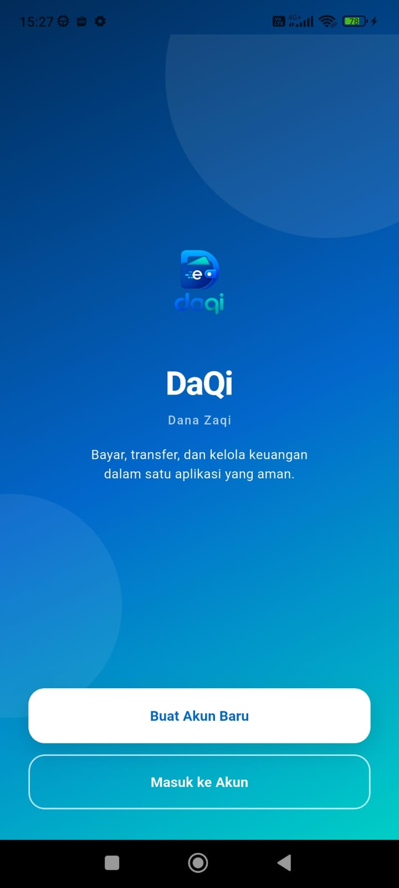</td>
    <td align="center">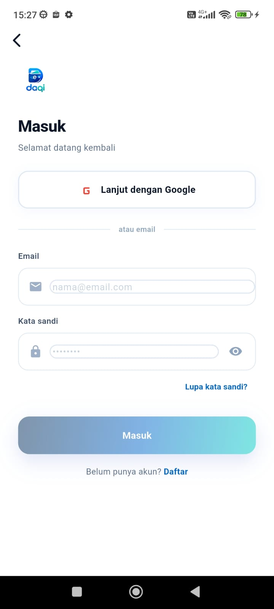</td>
    <td align="center">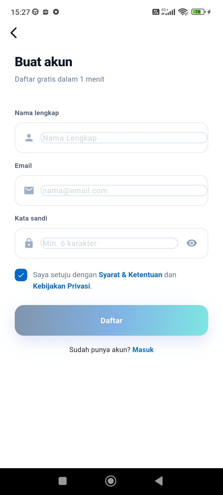</td>
  </tr>
  <tr>
    <td align="center"><b>4. Halaman Beranda (Saldo)</b></td>
    <td align="center"><b>5. Pengaturan Keamanan 2FA</b></td>
    <td align="center"><b>6. Notifikasi FCM</b></td>
  </tr>
  <tr>
    <td align="center">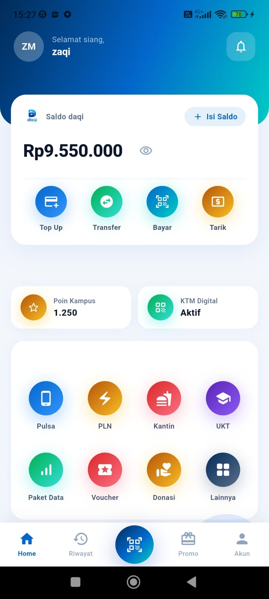</td>
    <td align="center">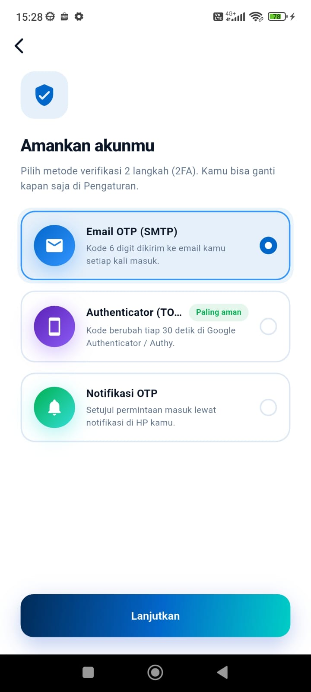</td>
    <td align="center">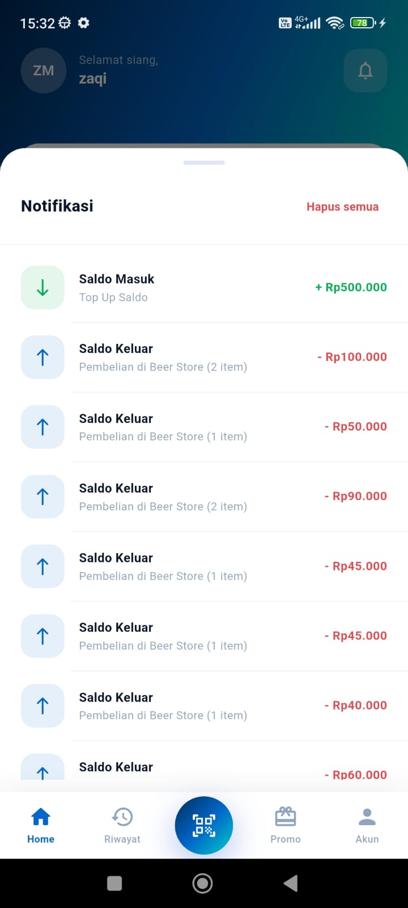</td>
  </tr>
  <tr>
    <td align="center"><b>7. Halaman Top Up Saldo</b></td>
    <td align="center"><b>8. Top Up Berhasil</b></td>
    <td align="center"><b>9. Riwayat Transaksi</b></td>
  </tr>
  <tr>
    <td align="center">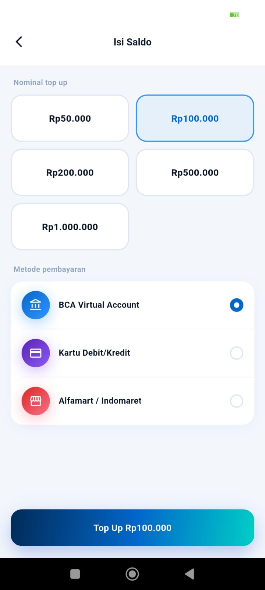</td>
    <td align="center">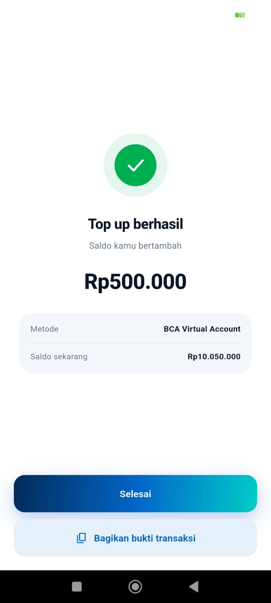</td>
    <td align="center">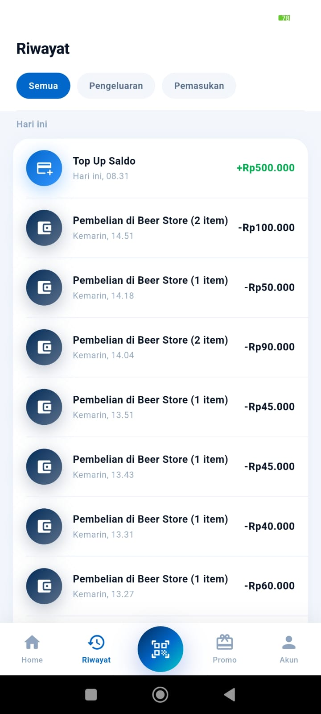</td>
  </tr>
</table>

### 🛍️ Mobile Store (Aplikasi E-Commerce)

<table>
  <tr>
    <td align="center"><b>1. Beranda Toko</b></td>
    <td align="center"><b>2. Detail Produk</b></td>
    <td align="center"><b>3. Keranjang Belanja</b></td>
  </tr>
  <tr>
    <td align="center">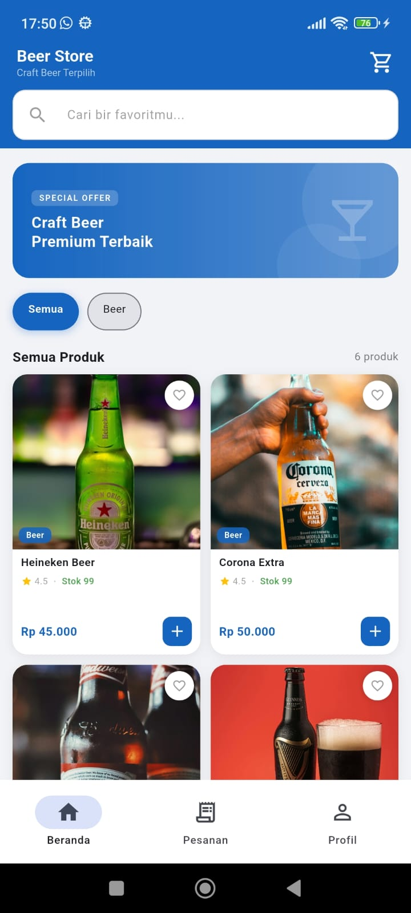</td>
    <td align="center">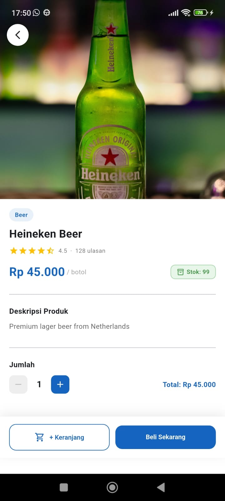</td>
    <td align="center">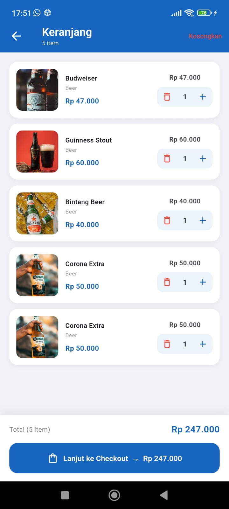</td>
  </tr>
  <tr>
    <td align="center"><b>4. Halaman Profil</b></td>
    <td align="center"><b>5. Halaman Checkout</b></td>
    <td align="center"><b>6. Halaman Gateway Pembayaran</b></td>
  </tr>
  <tr>
    <td align="center">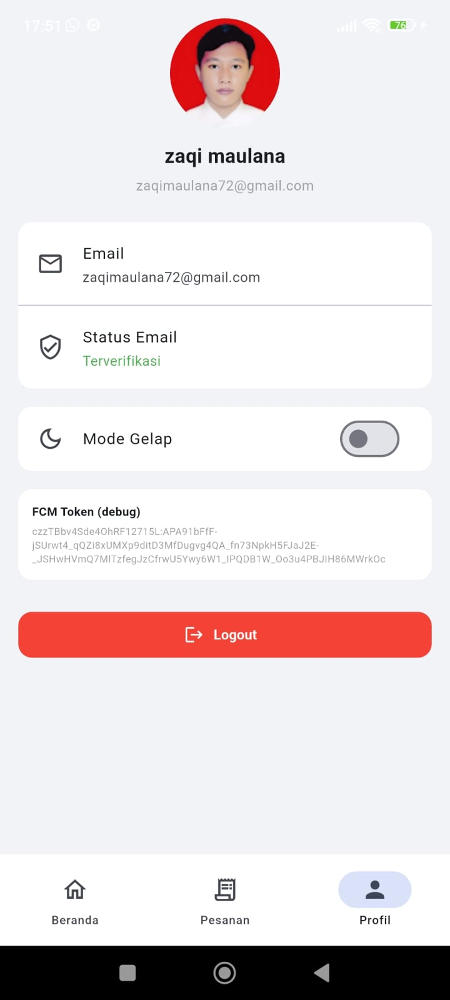</td>
    <td align="center">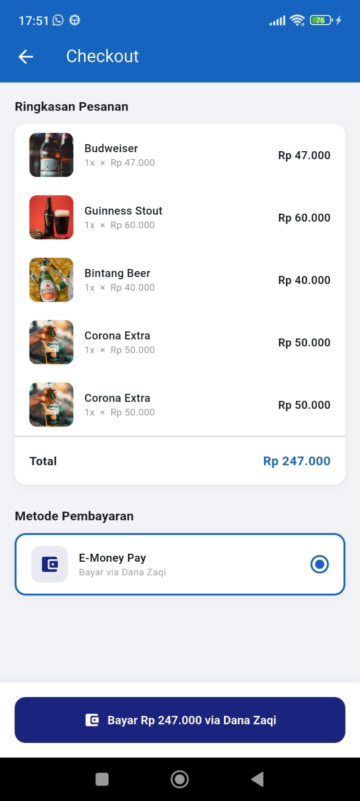</td>
    <td align="center">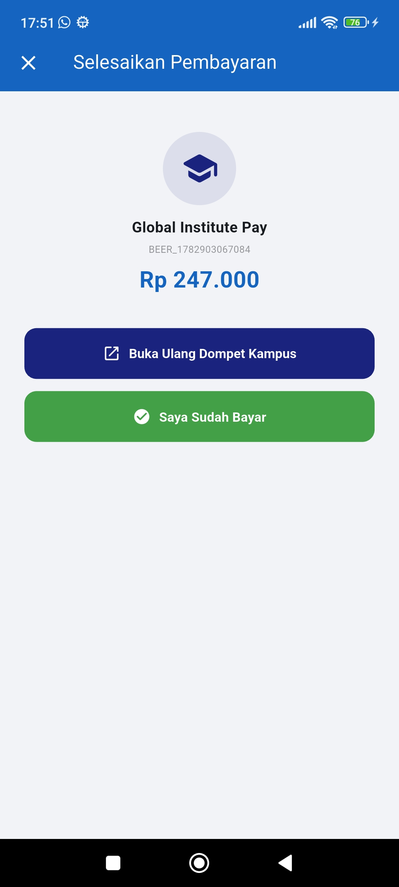</td>
  </tr>
  <tr>
    <td align="center"><b>7. Riwayat Pesanan</b></td>
    <td align="center"><b>8. Pesanan Berhasil</b></td>
    <td></td>
  </tr>
  <tr>
    <td align="center">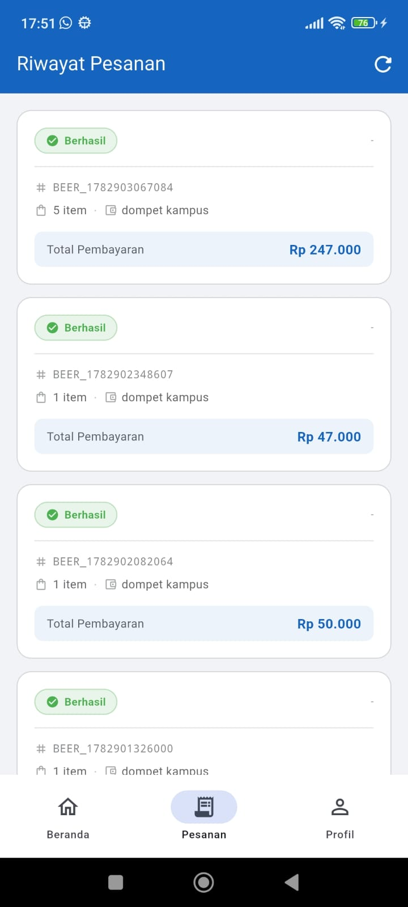</td>
    <td align="center">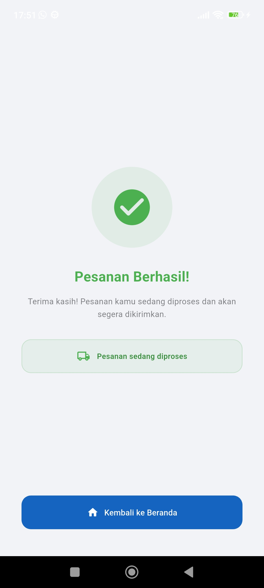</td>
    <td></td>
  </tr>
</table>

## 🔗 Implementasi App-to-App (Deep Link & 2FA)

Deep Link digunakan agar aplikasi **Mobile Store (E-Commerce)** bisa meminta pembayaran langsung ke **Dompet Kampus Global / Dana zaQi (DaQi)** tanpa pengguna perlu berpindah atau menyalin nominal transfer secara manual.

### Alur Lengkap Deep Link

```text
[Mobile Store]                             [Dompet Kampus Global]
      │                                           │
      │  1. User klik "Bayar via DaQi"            │
      │──────────────────────────────────────────▶│
      │  daqi://pay?merchant_id=X                 │
      │  &merchant_name=Y&amount=Z                │
      │  &callback=mobilestore://result           │
      │                                           │
      │                          2. Listener Deep Link menangkap URI
      │                          3. Tampil halaman Konfirmasi Pembayaran
      │                          4. User input kode Authenticator (2FA)
      │                          5. Backend proses transfer
      │                           │
      │  6. Callback: mobilestore://result        │
      │◀──────────────────────────────────────────│
      │  ?status=success&amount=Z                 │
```

<table>
  <tr>
    <td align="center"><b>1. Konfirmasi Pembayaran di E-Money</b></td>
    <td align="center"><b>2. Masukkan Kode Authenticator (2FA)</b></td>
    <td align="center"><b>3. Pembayaran Berhasil Dipotong</b></td>
  </tr>
  <tr>
    <td align="center">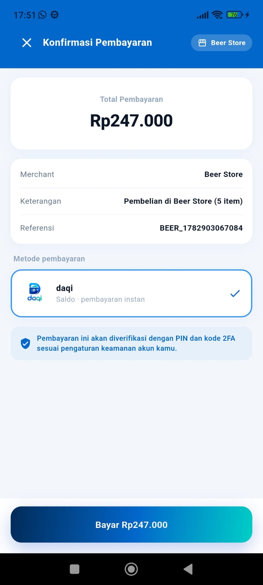</td>
    <td align="center">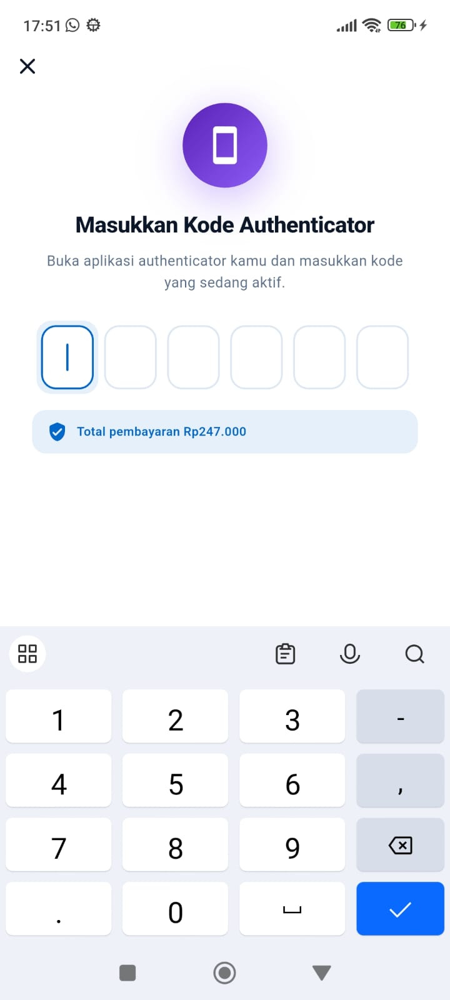</td>
    <td align="center">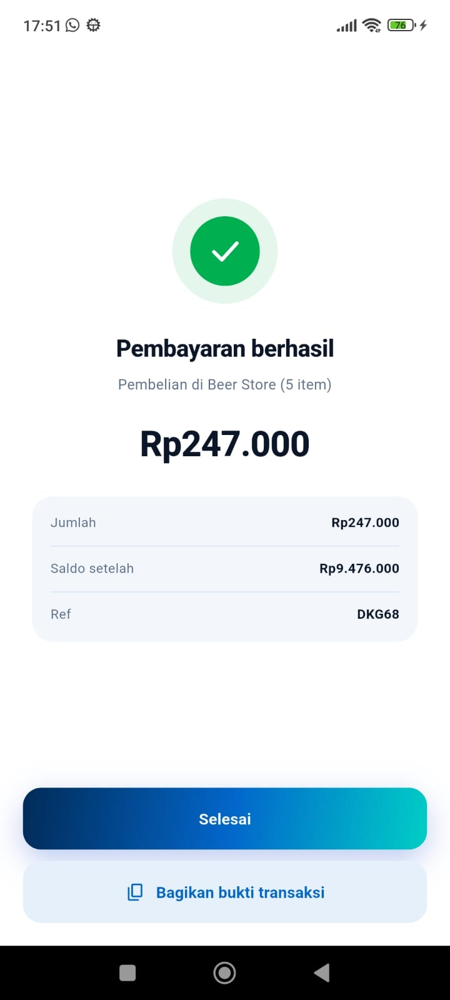</td>
  </tr>
</table>

---

## 🎬 Demo Video

*(Tautan YouTube akan segera diperbarui)*

---

## 📝 Catatan Teknis
- **Target OS:** Android 11+
- **Penyimpanan Sensitif:** Data Autentikasi disimpan secara terenkripsi.
- **Infrastruktur Backend:** Backend E-Money di-deploy pada VPS dengan akses `ssh root@202.155.95.224`, sedangkan aplikasi E-Commerce masih berjalan manual/secara lokal.
